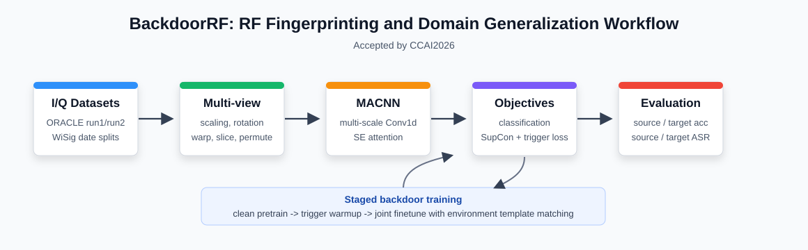

# BackdoorRF

本仓库是面向射频指纹识别与跨域泛化的 PyTorch 实验代码，实验工作已被 **CCAI2026** 收录。代码围绕 I/Q 信号分类、数据增强监督对比学习、可学习稀疏触发器和环境模板约束，评估模型在源域与目标域上的干净识别准确率以及后门攻击成功率。



## 项目结构

```text
main.py                         # 训练、测试和 train_test 主入口
run.py                          # 批量实验脚本，记录实验结果 CSV
test_from_results.py            # 从结果 CSV 复现实验评估或目标域适配
util/CNNmodel.py                # MACNN 模型与 SE 注意力模块
util/augmentation.py            # I/Q 信号增强方法
util/con_losses.py              # 监督对比学习损失
util/get_dataset.py             # ORACLE 与 WiSig 数据集读取
util/learnable_trigger.py       # 可学习稀疏触发器
util/residual_prior.py          # 环境模板生成与匹配损失
util/training_monitor.py        # 训练日志与 TensorBoard 记录
Dataset_ORALCE/                 # ORACLE 数据，目录名拼写需保持不变
Dataset_WiSig/                  # WiSig 数据
weight/                         # 模型检查点输出目录
log/                            # 训练日志输出目录
runs/                           # TensorBoard 输出目录
```

## 环境安装

建议使用独立 Python 环境。仓库未固定依赖版本，最小可运行依赖如下：

```bash
pip install torch torchvision numpy scipy scikit-learn torchsummary
```

CUDA 由 `--cuda` 参数和 `torch.cuda.is_available()` 共同决定；没有可用 GPU 时会回退到 CPU，但完整训练会明显变慢。

## 数据准备

代码支持 `ORACLE` 和 `WiSig` 两个数据集：

- `ORACLE`：数据应放在 `Dataset_ORALCE/run1/` 与 `Dataset_ORALCE/run2/` 下。注意目录名是 `Dataset_ORALCE`，该拼写已经写入代码。
- `WiSig`：数据应放在 `Dataset_WiSig/` 下，默认读取 `rx_1-1_date1.pkl` 到 `rx_1-1_date4.pkl`。

数据加载逻辑见 `util/get_dataset.py`。ORACLE 默认使用 run1 作为源域训练/源域测试，run2 作为目标域测试与适配数据；WiSig 默认使用 date1 训练，并在后续 date 上测试跨域表现。

## 快速使用

查看全部命令行参数：

```bash
python main.py --help
```

训练并测试 ORACLE：

```bash
python main.py --mode train_test --dataset_name ORACLE --model_size S --epochs 300
```

训练并测试 WiSig：

```bash
python main.py --mode train_test --dataset_name WiSig --model_size S --epochs 300
```

启用后门实验、可学习触发器和环境模板匹配：

```bash
python main.py --mode train_test --dataset_name ORACLE --model_size S --epochs 300 --backdoor --target_label 0 --poison_rate 0.01 --trigger_len 512 --trigger_amp 0.08 --environment_template_matching --monitor_backdoor --tensorboard
```

在已有检查点上测试：

```bash
python main.py --mode test --dataset_name ORACLE --model_size S --backdoor --checkpoint_path weight/your_checkpoint.pth
```

批量实验可从 `run.py` 启动；该脚本会根据配置运行多组实验，并写入 `experiment_results*.csv`。若需要从结果 CSV 中选择实验重新评估，可使用 `test_from_results.py`。

## 方法原理

输入数据是双通道 I/Q 序列。训练时，`AugDataset` 会为同一样本生成主视图和辅助视图，增强操作包括幅度缩放、通道旋转、片段置换、幅度扭曲、时间扭曲、窗口切片与窗口扭曲。

分类网络采用 `MACNN`：模型用多尺度一维卷积提取局部时序特征，用 SE 注意力对通道响应重新加权，再通过全局池化得到归一化 embedding 和分类 logits。`SupConLoss` 用于拉近同类样本在多增强视图下的表示距离，提高跨域鲁棒性。

后门实验中，`LearnableSparseTrigger` 学习一个双通道稀疏触发片段，可按固定、随机、高能量或低能量位置插入 I/Q 信号。训练流程分为干净预训练、触发器预热和联合微调三个阶段：先保证干净分类能力，再学习能诱导目标标签的触发器，最后在有限模型层上联合优化干净准确率与攻击成功率。

环境模板匹配由 `util/residual_prior.py` 实现。它生成或加载带限噪声模板，并在功率谱或时频谱空间约束触发器，使触发模式更接近背景射频环境。常用评价指标包括干净源域准确率、干净目标域准确率、源域 ASR 和目标域 ASR。

## 常用参数

| 参数 | 作用 |
| --- | --- |
| `--dataset_name {ORACLE,WiSig}` | 选择数据集 |
| `--mode {train,test,train_test}` | 选择训练、测试或训练后测试 |
| `--model_size {S,M,L}` | 控制 MACNN 通道宽度 |
| `--main_aug_depth` / `--aux_aug_depth` | 控制主视图和辅助视图增强强度 |
| `--backdoor` | 启用后门训练与测试流程 |
| `--target_label` | 后门目标类别 |
| `--poison_rate` | 训练集中投毒样本比例 |
| `--trigger_len` / `--trigger_amp` | 触发器长度与幅度 |
| `--trigger_position_mode` | 触发器插入位置策略 |
| `--environment_template_matching` | 启用环境模板匹配约束 |
| `--tensorboard` | 写入 TensorBoard 日志 |

## 输出与复现

模型检查点默认写入 `weight/`，文件名由数据集、模型规模、触发器配置、训练参数和随机种子等配置哈希生成。训练监控日志写入 `log/`，TensorBoard 日志写入 `runs/`。

推荐的快速检查命令：

```bash
python -m py_compile main.py util/*.py
python util/con_losses.py
```

## 说明

本仓库用于学术研究与授权安全评估。涉及后门触发器的实验应仅在合法、受控的数据与设备环境中运行。正式论文引用信息可在 CCAI2026 论文集发布后补充。
